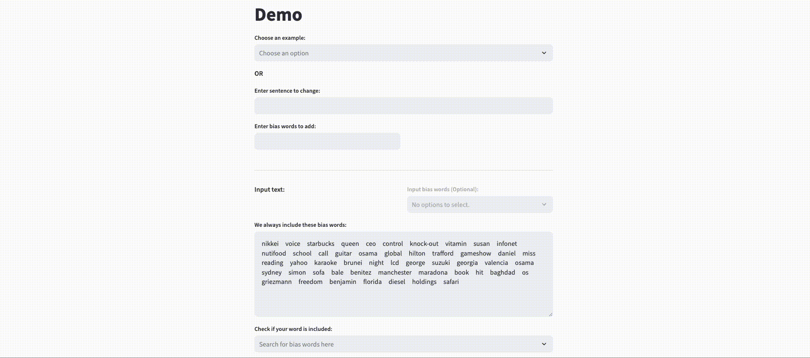
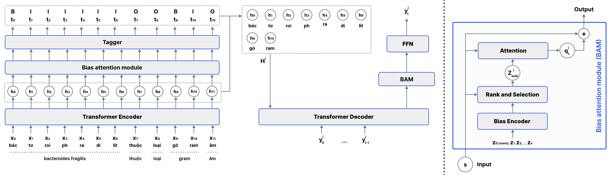
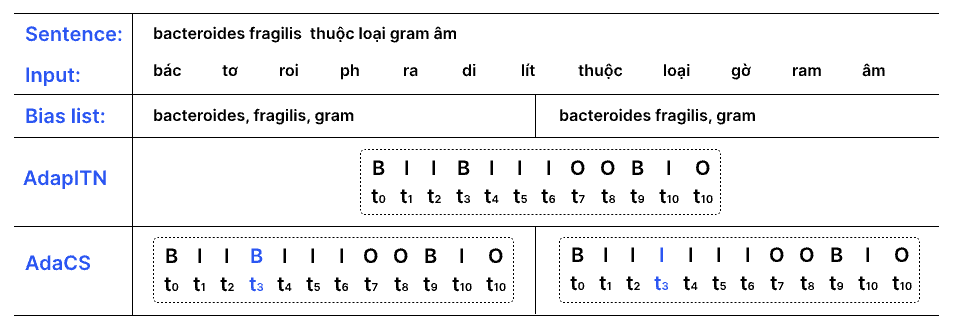
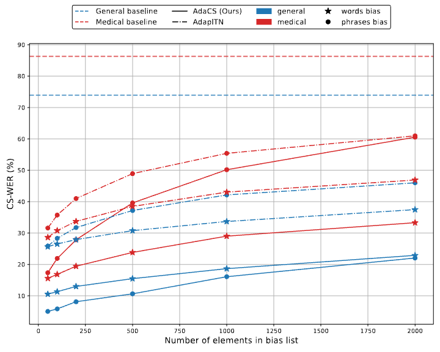

# <div align="center">🗣️💬 AdaCS: Adaptive Normalization for Enhanced Code-Switching ASR</div>

## 👋 Introduction

In this study, we propose AdaCS, a normalization model integrates an adaptive bias attention module (BAM) into encoder-decoder network. This novel approach provides a robust solution to CS ASR in unseen domains, thereby significantly enhancing our contribution to the field. By utilizing BAM to both identify and normalize CS phrases, AdaCS enhances its adaptive capabilities with a biased list of words provided during inference. Our method demonstrates impressive performance and the ability to handle unseen CS phrases across various domains.

## 🚀 Demo

Experience AdaCS in action and try it out with our [Live Demo](https://adacs-project.github.io)

<div align="center" style="width:100%;">
  
</div>

## 🤖 Model Release

### ⚙️ Model Architecture

AdaCS comprises a bias attention module, an encoder, and a decoder. Both the encoder and decoder blocks in AdaCS are integrated with the bias attention module to aid in the accurate and efficient identification and nor-malization of CS phrases, respectively.

<div align="center" style="width:100%;">
  
</div>

An example of the impact of the word bias list and phrase bias list on the Tagger of AdaCS and AdapITN:

<div align="center" style="width:100%;">
  
</div>

### 📊 Experiment setup

We compared AdaCS with traditional Transformer model as the baseline and other models including GPT-4o and AdapITN. In our experiments, we employed a variety of Word-Error-Rate (WER) metrics to evaluate the models: 
- **N-WER:** refers to the WER on the words that do not require normalization.
- **CS-WER:** refers to the WER on the CS normalization.
- **WER:** refers the error throughout the entire process of normalizing the spoken text output of ASR.

<div align="center" style="width:100%;">
  <table style="border-collapse:collapse; width:100%; margin: 0 auto; text-align:center; border: 1px solid;">
    <caption style="text-align:center;"><b>Evaluation results on the test-general and test-medical sets</b></caption>
    <thead style="border: 1px solid;">
      <tr>
        <th rowspan="2" style="text-align:center; border: 1px solid;">Model</th>
        <th rowspan="2" style="text-align:center; border: 1px solid;">Bias type</th>
        <th colspan="3" style="text-align:center; border: 1px solid;">test-general</th>
        <th colspan="3" style="text-align:center; border: 1px solid;">test-medical</th>
        <th rowspan="2" style="text-align:center; border: 1px solid;">Speed (examples/s)</th>
      </tr>
      <tr>
        <th style="text-align:center; border: 1px solid;"><em>N-WER</em></th>
        <th style="text-align:center; border: 1px solid;"><em>CS-WER</em></th>
        <th style="text-align:center; border: 1px solid;"><em>WER</em></th>
        <th style="text-align:center; border: 1px solid;"><em>N-WER</em></th>
        <th style="text-align:center; border: 1px solid;"><em>CS-WER</em></th>
        <th style="text-align:center; border: 1px solid;"><em>WER</em></th>
      </tr>
    </thead>
    <tbody style="border: 1px solid;">
      <tr>
        <td style="text-align:center; border: 1px solid;">Transformers</td>
        <td style="text-align:center; border: 1px solid;">None</td>
        <td style="text-align:center; border: 1px solid;">15.9</td>
        <td style="text-align:center; border: 1px solid;">73.9</td>
        <td style="text-align:center; border: 1px solid;">28.5</td>
        <td style="text-align:center; border: 1px solid;">29.5</td>
        <td style="text-align:center; border: 1px solid;">86.3</td>
        <td style="text-align:center; border: 1px solid;">37.1</td>
        <td style="text-align:center; border: 1px solid;">6.6</td>
      </tr>
      <tr>
        <td rowspan="3" style="border: 1px solid;">GPT-4o</td>
        <td style="text-align:center; border: 1px solid;">None</td>
        <td style="text-align:center; border: 1px solid;">8.2</td>
        <td style="text-align:center; border: 1px solid;">76.3</td>
        <td style="text-align:center; border: 1px solid;">15.4</td>
        <td style="text-align:center; border: 1px solid;">9.1</td>
        <td style="text-align:center; border: 1px solid;">72.4</td>
        <td style="text-align:center; border: 1px solid;">15</td>
        <td style="text-align:center; border: 1px solid;">0.11</td>
      </tr>
      <tr>
        <td style="text-align:center; border: 1px solid;">Words</td>
        <td style="text-align:center; border: 1px solid;">8.7</td>
        <td style="text-align:center; border: 1px solid;">70.3</td>
        <td style="text-align:center; border: 1px solid;">14.7</td>
        <td style="text-align:center; border: 1px solid;">9.8</td>
        <td style="text-align:center; border: 1px solid;">68.9</td>
        <td style="text-align:center; border: 1px solid;">14.7</td>
        <td style="text-align:center; border: 1px solid;">0.08</td>
      </tr>
      <tr>
        <td style="text-align:center; border: 1px solid;">Phrases</td>
        <td style="text-align:center; border: 1px solid;">9</td>
        <td style="text-align:center; border: 1px solid;">67.9</td>
        <td style="text-align:center; border: 1px solid;">14.8</td>
        <td style="text-align:center; border: 1px solid;">9.8</td>
        <td style="text-align:center; border: 1px solid;">69</td>
        <td style="text-align:center; border: 1px solid;">14.7</td>
        <td style="text-align:center; border: 1px solid;">0.08</td>
      </tr>
      <tr>
        <td rowspan="3" style="border: 1px solid;">AdapITN</td>
        <td style="text-align:center; border: 1px solid;">None</td>
        <td style="text-align:center; border: 1px solid;">19.2</td>
        <td style="text-align:center; border: 1px solid;">61.3</td>
        <td style="text-align:center; border: 1px solid;">19.1</td>
        <td style="text-align:center; border: 1px solid;">25.3</td>
        <td style="text-align:center; border: 1px solid;">62.3</td>
        <td style="text-align:center; border: 1px solid;">24.4</td>
        <td style="text-align:center; border: 1px solid;"><strong><u>25</u></strong></td>
      </tr>
      <tr>
        <td style="text-align:center; border: 1px solid;">Words</td>
        <td style="text-align:center; border: 1px solid;">3.0</td>
        <td style="text-align:center; border: 1px solid;">33.7</td>
        <td style="text-align:center; border: 1px solid;">6.4</td>
        <td style="text-align:center; border: 1px solid;">3.1</td>
        <td style="text-align:center; border: 1px solid;">43.0</td>
        <td style="text-align:center; border: 1px solid;">7.6</td>
        <td style="text-align:center; border: 1px solid;">14.9</td>
      </tr>
      <tr>
        <td style="text-align:center; border: 1px solid;">Phrases</td>
        <td style="text-align:center; border: 1px solid;">2.62</td>
        <td style="text-align:center; border: 1px solid;">42.1</td>
        <td style="text-align:center; border: 1px solid;">7.3</td>
        <td style="text-align:center; border: 1px solid;">3.3</td>
        <td style="text-align:center; border: 1px solid;">55.4</td>
        <td style="text-align:center; border: 1px solid;">8.9</td>
        <td style="text-align:center; border: 1px solid;">9.45</td>
      </tr>
      <tr>
        <td rowspan="3" style="border: 1px solid;">AdaCS (ours)</td>
        <td style="text-align:center; border: 1px solid;">None</td>
        <td style="text-align:center; border: 1px solid;">20.7</td>
        <td style="text-align:center; border: 1px solid;">62.5</td>
        <td style="text-align:center; border: 1px solid;">20.2</td>
        <td style="text-align:center; border: 1px solid;">28.1</td>
        <td style="text-align:center; border: 1px solid;">69.3</td>
        <td style="text-align:center; border: 1px solid;">26.4</td>
        <td style="text-align:center; border: 1px solid;">23.6</td>
      </tr>
      <tr>
        <td style="text-align:center; border: 1px solid;">Words</td>
        <td style="text-align:center; border: 1px solid;">1.4</td>
        <td style="text-align:center; border: 1px solid;">18.6</td>
        <td style="text-align:center; border: 1px solid;">3.3</td>
        <td style="text-align:center; border: 1px solid;"><strong><u>2.2</u></strong></td>
        <td style="text-align:center; border: 1px solid;"><strong><u>29.0</u></strong></td>
        <td style="text-align:center; border: 1px solid;"><strong><u>4.8</u></strong></td>
        <td style="text-align:center; border: 1px solid;">14.7</td>
      </tr>
      <tr>
        <td style="text-align:center; border: 1px solid;">Phrases</td>
        <td style="text-align:center; border: 1px solid;"><strong><u>1.2</u></strong></td>
        <td style="text-align:center; border: 1px solid;"><strong><u>16.1</u></strong></td>
        <td style="text-align:center; border: 1px solid;"><strong><u>2.8</u></strong></td>
        <td style="text-align:center; border: 1px solid;">3.1</td>
        <td style="text-align:center; border: 1px solid;">50.1</td>
        <td style="text-align:center; border: 1px solid;">7.8</td>
        <td style="text-align:center; border: 1px solid;">8.92</td>
      </tr>
    </tbody>
  </table>
</div>
<p></p>

These experimental results underscore the performance
of AdaCS, particularly in handling code-switching and its
adaptability within both general and domain-specific datasets.

### 📈 Result & Analysis

<div align="center" style="width:100%;">
  <figure>
    <figcaption style="text-align:center;"><b>Performance of AdaCS vs AdapITN as the size of the bias list increases</b></figcaption>
    
  </figure>
</div>
<p></p>

In general,the effectiveness of both models that employ context-aware biasing tends to decline as the quantity of bias words rises. However, their CS-WER remains superior to the baseline. Furthermore, it is shown that AdaCS consistently outperforms AdapITN as the number of elements in the bias list changes across both test sets.

### 📥 Download Model

- Model checkpoint: [AdaCS Model](https://github.com/adacs-project/repository/releases)

## 💾 Dataset Release

### ❓ About Data

We constructed a dataset for intra-sentential CS for Vietnamese (a low-resource language) with a total of 50,000 general-domain examples for the development set and 4,000 examples for the evaluation set including general and medical domains.

### 🧪 Data Sample

Examples of reference, input, words and phrases bias list in the general-test and medical-test, at "easy" and "hard" levels:

<div align="center" style="width:100%;">
  <table style="border-collapse:collapse; width:100%; margin: 0 auto; border: 1px solid;">
    <tbody>
      <tr style="text-align:center !important;">
        <td style="text-align:center !important; border: 1px solid;"><strong>test-general - easy sample</strong></td>
      </tr>
      <tr>
        <td style="border-left: 1px solid; border-right: 1px solid; border-top: 1px solid; border-bottom: 1px solid transparent;"><strong>Reference:</strong> Ông học tập thiết kế động cơ cơ bản từ <em><u>Chevrolet</u></em> và nghiên cứu khung gầm xe tải của <em><u>Ford</u></em>.</td>
      </tr>
      <tr>
        <td style="border-left: 1px solid; border-right: 1px solid; border-top: 1px solid; border-bottom: 1px solid transparent;"><strong>Input:</strong> Ông học tập thiết kế động cơ cơ bản từ <em><u>che vô lét</u></em> và nghiên cứu khung gầm xe tải của <em><u>pho</u></em>.</td>
      </tr>
      <tr>
        <td style="border: 1px solid;"><strong>Words bias:</strong> Chevrolet, Ford</td>
      </tr>
      <tr style="text-align:center !important;">
        <td style="text-align:center; border: 1px solid;"><strong>test-medical - hard sample</strong></td>
      </tr>
      <tr>
        <td style="border-left: 1px solid; border-right: 1px solid; border-top: 1px solid; border-bottom: 1px solid transparent;"><strong>Reference:</strong> <em><u>Botulism Antitoxin Heptavalent</u></em> là thuốc giải duy nhất cho những trường hợp nhiễm vi khuẩn <em><u>Clostridium botulinum</u></em>.</td>
      </tr>
      <tr>
        <td style="border-left: 1px solid; border-right: 1px solid; border-top: 1px solid; border-bottom: 1px solid transparent;"><strong>Input:</strong> <em><u>Bô tu lim an ti tô xin hép ta va len</u></em> là thuốc giải duy nhất cho những trường hợp nhiễm vi khuẩn <em><u>cờ lo tờ ri đi um bô tu li num</u></em>.</td>
      </tr>
      <tr>
        <td style="border: 1px solid;"><strong>Phrases bias:</strong> Botulism Antitoxin Heptavalent, Clostridium botulinum</td>
      </tr>
    </tbody>
  </table>
</div>

### 📝 Data Structure

```bash
├── train_set
│   ├── ....
│   │   ├── train1.csv
│   │   ├── train2.csv
│   │   ├── train3.csv
│   ├── ....
│   ├── ....
│   ├── ....
├── test_set
│   ├── ....
│   │   ├── test1.csv
│   │   ├── test2.csv
│   │   ├── test3.csv
│   ├── ....
│   ├── ....
│   ├── ....
│   │   ├── ....
```

### 📥 Download Dataset

- Download the dataset: [AdaCS Dataset](https://github.com/adacs-project/repository/data)